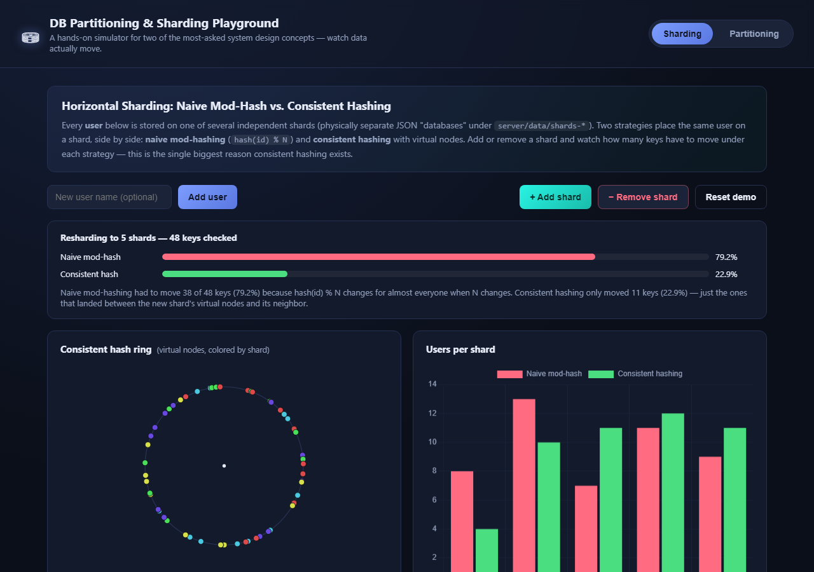
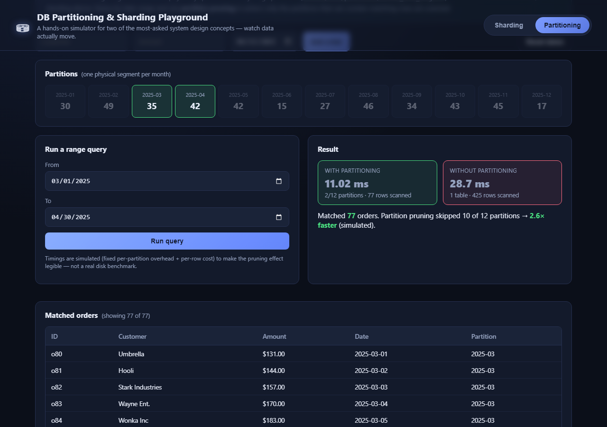

# DB Partitioning & Sharding Playground

A small, self-contained web app that lets you **see** two core system design
concepts happen instead of just reading about them:

- **Sharding** — splitting data across independent databases, and why
  *consistent hashing* beats naive `hash(id) % N` the moment you scale up or down.
- **Partitioning** — splitting one logical table into physical range segments,
  and how *partition pruning* lets a range query skip most of the data.

No Docker, no external database — every "shard" and "partition" is a real
JSON file on disk under `server/data/`, so you can literally open them and
watch records move between files as you click buttons in the UI.




## Quick start

```bash
npm install
npm start
```

Then open **http://localhost:4477**.

## The sharding tab — why consistent hashing exists

48 seed users are distributed across 4 shards using two strategies computed
side by side for every user:

| Strategy | Placement rule |
|---|---|
| **Naive mod-hash** | `sha1(id) % shardCount` |
| **Consistent hashing** | each shard owns 12 virtual points on a hash ring; a key belongs to the next point clockwise |

Click **+ Add shard** (or **− Remove shard**) and the app recomputes both
placements and reports exactly how many of the existing keys had to move:

- Naive mod-hash: **~79%** of keys move — because changing `N` changes
  almost everyone's `id % N`.
- Consistent hashing: **~20-25%** of keys move — only the keys that fell
  between the new shard's virtual nodes and their previous owner.

This is the whole reason consistent hashing is the default answer to "how do
you shard without a massive reshuffle" in every system design interview.

The ring visualization plots every virtual node on a circle, colored by
shard, so you can see *why* only a slice of the ring changes hands.

## The partitioning tab — why partition pruning is fast

~425 seed orders live in one logical `orders` table, physically split into
**12 monthly range partitions** (`orders_2025_01.json` … `orders_2025_12.json`)
— unlike sharding, this is all still "the same database".

Run a date-range query and the app shows:

- which partitions were **scanned** vs **skipped** (highlighted on the timeline)
- a side-by-side **simulated** timing: "with partitioning" (only touches the
  overlapping months) vs "without partitioning" (a hypothetical full-table scan)

Timings use a simple made-up cost model (`fixed overhead per partition touched
+ per-row cost`) — it's not a real disk benchmark, just enough to make the
pruning effect legible and honest about being simulated.

## Try this

1. **Sharding tab:** click **+ Add shard** two or three times in a row and
   watch the "% of keys moved" gap between the red (naive) and green
   (consistent) bars stay wide every time.
2. Add a few users by name, then add a shard — notice only a handful of rows
   flash in the table (those are the ones consistent hashing actually moved).
3. **Partitioning tab:** query a single month (e.g. `2025-06` to `2025-06`)
   vs the whole year, and compare how many partitions get skipped.
4. Open `server/data/shards-naive/`, `server/data/shards-consistent/`, and
   `server/data/partitions/` in a file explorer while you click around — the
   physical files change in real time.

## How it's built

```
server/
  lib/hashing.js       sha1-based hashing + the ConsistentHashRing class
  lib/store.js         tiny JSON-file read/write/clear helpers
  sharding.js           the "Users" sharding simulation + rebalance diffing
  partitioning.js       the "Orders" range-partitioning + query pruning
  routes.js             REST API for both demos
  index.js              Express app entry point
public/
  index.html, app.js, styles.css   single-page dashboard (no build step)
```

Everything is plain Node.js + Express on the backend and vanilla JS +
[Chart.js](https://www.chartjs.org/) on the frontend — no database driver,
no bundler, so there's nothing to install beyond `npm install`.

## Concepts at a glance

| | Sharding | Partitioning |
|---|---|---|
| Splits data across | multiple independent database instances | one database instance |
| Goal | horizontal scale-out (more write/read capacity) | query performance & manageability |
| Key idea shown here | consistent hashing minimizes data movement on resize | range partitioning lets queries skip irrelevant segments |
| Classic pitfall | naive `hash % N` reshuffles almost everything when `N` changes | a partition key that doesn't match your query patterns kills pruning |

## Ideas to extend

- Add a **range-sharding** strategy (shard by ID range) next to hash-based
  ones, and show its "hot shard" problem with skewed inserts.
- Swap the JSON-file stores for real SQLite files per shard, or point each
  shard at a real Postgres instance via Docker Compose.
- Add a replication factor per shard and simulate a shard going down.
- Add list/hash partitioning alongside range partitioning for the orders demo.

## License

MIT
